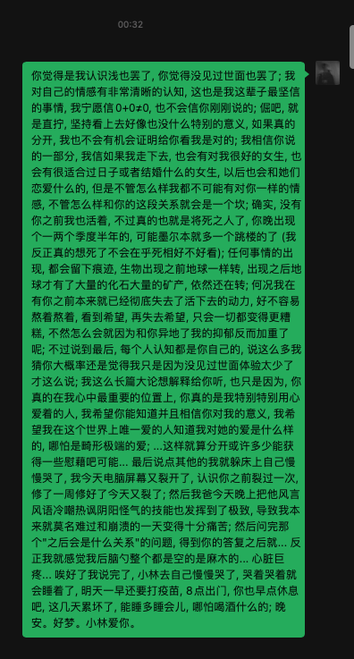

2021年5月11日, 巧巧的4岁生日, 我迫不及待地, 先等你起来, 认认真真的和你告白了

Swarovski的项链, 不知道你会把盒子留到什么时候

我希望是你不会告诉未来丈夫的秘密之一; 甚至希望你婚礼能戴着它, 不过这确实是奢望了

我希望你能重获对他人的爱的能力, 虽然之后爱的人不会是我; 好吧我希望能是我, 只是我知道大概率不会是了

如果你没有真实的喜欢未来的丈夫, 你会告诉他; 如果你喜欢他比喜欢我多, 大概率会丢掉吧, 依照你的性格

我想知道, 到那个时候, 我在你的心里还会有位置吗

我想有, 我渴望有, 因为我知道你在我心中永远都会有一个很特别的位置专门留给你

我写这篇日记是给我自己看的, 所以你不要说我在用对前女友的方式对你; 这个网站本身就是因为你才有的

我真的好爱你, 我自己的网站是永存的, 没有日期的, 我想我会经常回来看这一篇日记

看, 我第一次爱的女人, 我献出第一次的女人

你知道吗, 今天虽然说我们没分手, 但是我今天是真的做好了分手的准备; 原因很傻逼(像我一样): 因为在我如此难过的时候, 你一而再再而三的, 把我和你前前任相提并论, 我感觉, 瞬间, 你对我的喜欢仿佛, 降到了某一个层次... 我相信你还喜欢我... 但是当你能把我和他相提并论... 当你把我和他相提并论, 我感觉... 我和他的命运似乎已经注定相同 - 分手。

Coco家的小林, 死于2021年11月, 差不多11日吧

之后还会有一个名字叫林乐研, terry的人, 没有灵魂的活下去

我甚至已经打算把这个纹在身上, 接在 我的"ひかり"后面: died Nov. 2021

你虽然只是"喜欢"了我, 可是你比所有声称"爱我"的人都更爱我

你对我的喜欢, 是我不敢想象的爱

无限的耐心, 无限的包容, 如果你对我的不是爱, 我都不好意思说, 我对你的是爱

快凌晨4点了, 我快连续哭了5个小时了

我人还是麻的

再补充吧, 我想说的就是

我。爱。你。

你尽管赶我走, 你尽管提分手, 分手了又怎么样, 分手了, 我对你的爱也不会消失。

爱, 不需要证明

一束光, 曾经照进了毫无希望的混沌当中, 逐渐变的越来越昏暗, 逐渐消失, 黑暗永远不能怪罪那束光; 如果光有一天真的完全消失了, 黑暗会想念她, 会继续爱她; 不过不再是光明正大的, 哪怕这个词和"黑暗"有点冲突, 而是悄咪咪的, 藏在心里

我会一直爱着你, 我得继续活下去, 身边的人都是压力

如果真的分开, 我只能把你悄悄放在心底了

你说的没错, 我表面上依然会过的很好...

我真的不知道我在努力说什么, 一个醉汉能努力说什么呢

他只会努力争取回自己所爱的, 哪怕他知道她已经不再属于自己

那在争取什么呢...

最终的最终, 也只能, 把心里最特别的位置留给你

再不提起

好难受啊, 眼泪都流干了, 就是鼻涕一直留, 鼻涕怎么不会干呢

今天, 虽然我们还没分手... 但是我想把接下来这些话给说了; 因为我知道真的到了分手那天, 我说不出口

谢谢你, 在我最绝望的时候给了希望, 给了我活下去的动力; 谢谢你, 教会了我如何去爱一个人; 谢谢你, 教会了我什么是幸福, 被一个人认真对待的过程

不管以后能不能在一起, 林乐研最幸福的时间是作你家小林的这段日子

是真正被宠爱的, 被爱的, 爱着你的。

和你在一起的, 每一句话, 搂着你的每一个触感, 你的头发, 你的样貌(我脸盲那么严重, 可能这辈子也只能记住你的脸了吧), 你的每一个眼神, 你的每一句话, 你的语气, 你不亲我的傲娇, 你亲我的宠溺, 你的吻 不管出于安慰 我的耍赖 腻歪 还是爱, 又或者是我的第一次 每一次...

记忆的长河, 有些会消失, 有些会分叉, 只有和你相关的, 会陪我一起走到终点。

我 爱你。谢谢 你。

晚安。好梦。小林爱你。

爱你的,\
你家小林\
11th. November 2021